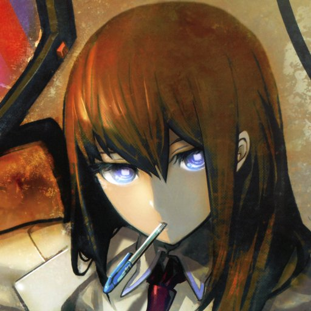

# I do comp sci 🥵🥵

## About Me: 😄
What I like ✅:
- Java🍵 | C++/C🏎️💨| Python🐍
- Anime
- ABG's
- Photography
- VS CODE!

What I don't like 🚩😠:
- COMP SCI 101!!! (free gpa thoe can't complain)
- C# and PHP 🤮
- VS STUDIO 🤮
- SHIT LIKE THIS:
  ```
  if(a == 0);
  {
    int *ptr = NULL;
    *ptr;
  }
  ```
## 🛠️ Technologies & Tools
- **Primary Language**: Python 🐍
- **Learning**: Kotlin, Java, C, C++, HTML/CSS, JavaScript
- **Editor of Choice**: VS Code, Python IDE (For quick and dirty things)

## 📈 GitHub Stats (YIKES)


## 📫 Connect with Me
[](https://discordapp.com/users/530883376048242698)
[](https://www.instagram.com/wilson._.joe/)  

> "Code is like humor. When you have to explain it, it’s bad." – Cory House

Every morning if C# didn't exist:

